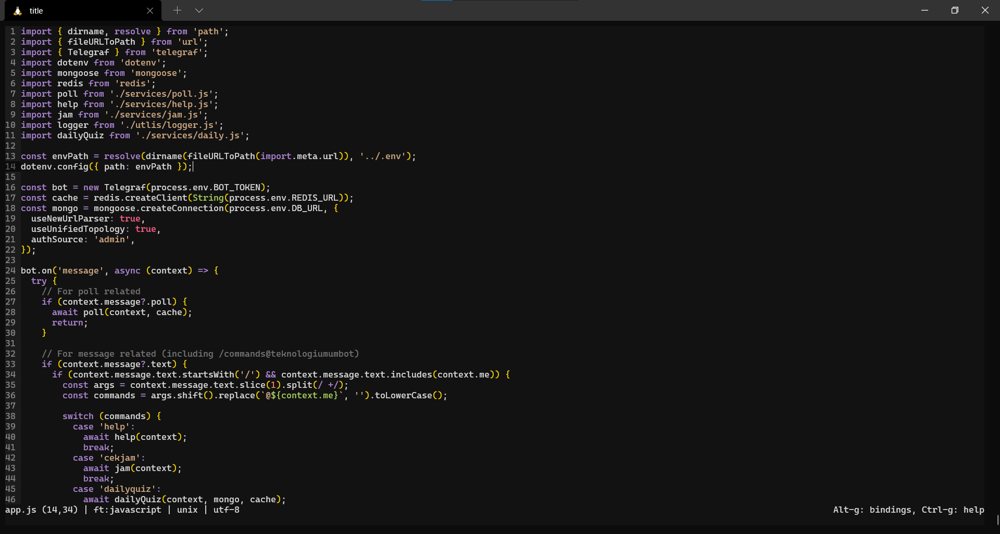
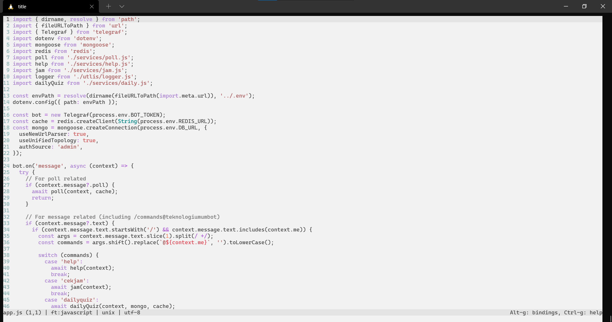

# Night Owl Theme for Micro

A [Night Owl](https://github.com/sdras/night-owl-vscode-theme) color scheme port for [Micro](https://github.com/zyedidia/micro) editor.

This color scheme works, but it's still a work in progress. 

## Installation & usage

As of now, I haven't put a PR to the plugin repository as I'm not confident enough of this theme port. Buuut, you can use it on your own!

1. Create a file called `night-owl.micro` or `light-owl.micro` in `~/.config/micro/colorschemes`.
2. Copy and paste the theme settings from this repository.
3. Open Micro, `Ctrl + E` and `set colorscheme night-owl` (or light-owl if you prefer).
4. Enjoy :)

## Screenshots

